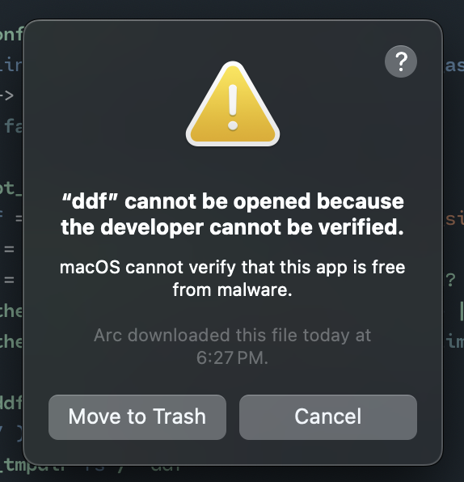
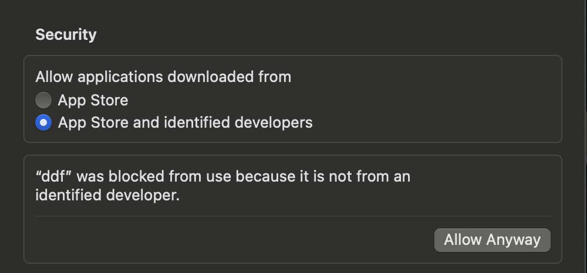
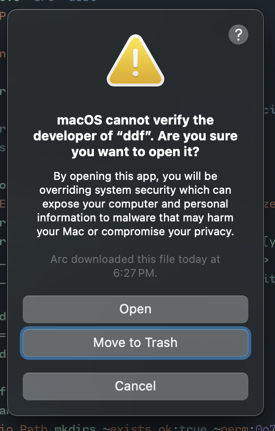

# `ddf`

[](https://github.com/chrstntdd/ddf/actions/workflows/build.yml)

> `d`iscard `d`irectories `f`ast

> [!IMPORTANT]
> `mv`s directories and files to `$TMPDIR` for quick cleanup

## Why

I wanted to try out OCaml 5 and with the new stable `eio` library. Also, clearing out `node_modules` and other build artifacts with `rm -rf` takes too long.

## Usage

The main form of input is a list of directories and/or files as a space separated list of arguments.

For best results, compose with `fd` or `find` to ensure correctly matching items on your file system.

Cleanup `node_modules` across a monorepo

```sh
ddf $(fd -t d -d 3 -a --no-ignore --prune node_modules)
```

Cleanup local opam/dune deps

```sh
ddf _opam _build
```

Get help.

```sh
ddf --help
```

Output example:

```sh
DDF(1)                            Ddf Manual                            DDF(1)

NAME
       ddf - `mv`s directories and files to `$TMPDIR` for quick cleanup

SYNOPSIS
       ddf [-i] [--yolo] [OPTION]… FILE/DIR…

DESCRIPTION
       ddf discards each specified FILE/DIR by moving it to a directory in
       `$TMPDIR`, listed below.

       Discarded FILE/DIRs are moved to this directory:
       /var/ddf

       To discard a FILE/DIR whose name starts with a -, for example -foo, use
       one of these commands:

       ddf -- -foo
       ddf ./-foo

OPTIONS
       -i  Prompt before every operation.

       -y, --yolo
           Ignore nonexistent files and never prompt.

COMMON OPTIONS
       --help[=FMT] (default=auto)
           Show this help in format FMT. The value FMT must be one of auto,
           pager, groff or plain. With auto, the format is pager or plain
           whenever the TERM env var is dumb or undefined.

       --version
           Show version information.

EXIT STATUS
       ddf exits with:

       0   on success.

       123 on indiscriminate errors reported on standard error.
```

## Setup

1. [Install `opam`](https://opam.ocaml.org/doc/Install.html).

   Opam will be used to install dependencies. One such dependency is `dune`, the build tool.

   You may have `dune` locally on your own system, but for consistency, we will use `opam exec` to run dune within the context of the local switch.

2. Create a local switch with `opam`

   ```sh
   opam switch create . --deps-only --with-test
   ```

   This command will read all the `*.opam` files and download all dependencies.

   You will be prompted along the process.

3. Build CLI with `dune` from the local switch
   ```sh
   opam exec -- dune build bin
   ```
4. Verify `ddf.exe`

   ```sh
   eza --tree ./_build/default
   ```

   ```sh
   ./_build/default
   ├── bin
   │  ├── ddf.exe # 👈
   │  ├── ddf.ml
   │  └── ddf.mli
   ├── ddf.dune-package
   ├── ddf.install
   ├── ddf.opam
   ├── lib
   │  ├── lib.a
   │  ├── lib.cma
   │  ├── lib.cmxa
   │  ├── lib.cmxs
   │  └── lib.ml
   ├── test
   │  ├── test.exe
   │  ├── test.ml
   │  └── test.mli
   ├── test.dune-package
   ├── test.install
   └── test.opam
   ```

For production, be sure to include the release flag:

```sh
opam exec -- dune build --profile release bin
```

## Development

Run `dune` in watch mode to get a fast development feedback loop.

```sh
opam exec -- dune exec bin/ddf.exe --watch -- --help
```

## Testing

Tests are organied into their own dune project.

Currently, unit tests with Alcoltest are used.

```sh
opam exec -- dune runtest
```

## Execution

Once the built with `dune`, you can invoke the executable directly:

```sh
./_build/default/bin/ddf.exe --help
```

or with `dune`

```sh
opam exec -- dune exec/bin/ddf.exe -- --help
```

If you are consuming the binary from the build artifacts, ensure you allow the `ddf.exe` to be executable:

```sh
chmod +x ddf.exe
```

## Installation

### MacOS

Install from release page for your environment. Be mindful of the platform architecture.

> [!IMPORTANT]
> If you have an M-series Mac, you must download the `*-macos-latest-arm64` build.

On MacOS, extract the binary to a location you prefer, like `usr/bin`.

Rename the file to drop the .exe

```sh
mv ./ddf.exe ddf
```

Allow the application to be executable

```sh
chmod +x ddf
```

Attempt to run the help page and acknowledge the OS prompt

```sh
./ddf --help
```

<div align="center">

</div>

Press `Cancel`

Open System Preferences

Scroll down to Security section, allow `ddf`

<div align="center">

</div>

Attempt to run `ddf` again

Acknowledge, AGAIN that we want to run this program

<div align="center">

</div>

Return to see the output of the help page shown in your terminal.

From now on you can invoke the binary without all the interruptions.

Link `ddf` on your system $PATH.

Note that this assumes you have the `ddf` binary in the `/usr/bin/` directory as such:

```sh
 eza --tree /usr/bin/
.
├── ddf
```

You may choose a directory of your own choosing.

Add the following to your `.bashrc` equivalent.

```sh
export DDF_HOME="/usr/bin/ddf"
export PATH="$DDF_HOME:$PATH"
```

Reload or source and you should now be able to execute `ddf` anywhere in your shell.

## Questions and Answers

### Where is everything moved to?

The tmp directory is defined via the [OCaml Filename module in the standard library](https://ocaml.org/manual/5.1/api/Filename.html#VALget_temp_dir_name):

> The name of the temporary directory: Under Unix, the value of the `TMPDIR` environment variable, or "/tmp" if the variable is not set. Under Windows, the value of the `TEMP` environment variable, or "." if the variable is not set. ..

`ddf` creates a child directory (called "ddf") to use as the destination for all discarded items.

## Prior art

- [`rip`](https://github.com/nivekuil/rip)
- [`mvf`](https://github.com/chrstntdd/mvf)
  The first prototype of this same functionality in ReasonML without the nice CLI. If I can ever get the build tooling right, it would be nice to have Pastel back in the mix somehow. Maybe a single module for rendering CLI output prompts in ReasonML with native jsx? 🤔
